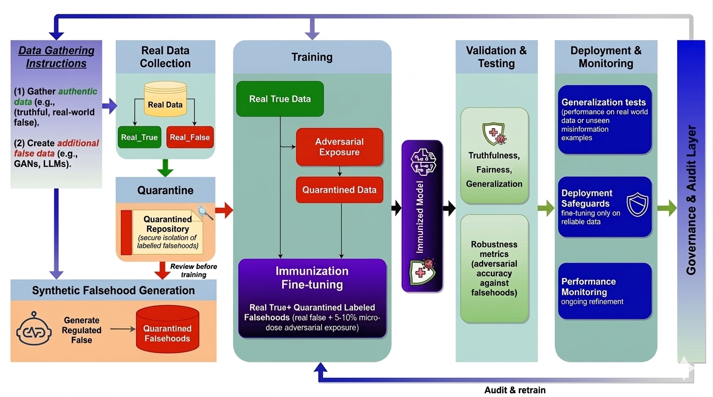

# Just as Humans Need Vaccines, So Do Models: Model Immunization to Combat Falsehoods

[]()
[]()
[](https://opensource.org/licenses/MIT)

This is the official implementation of the paper **"Just as Humans Need Vaccines, So Do Models: Model Immunization to Combat Falsehoods"**, and under review at **ACL 2026**.

> **Abstract:** Large language models reproduce misinformation not only by memorizing false statements, but by learning the linguistic patterns that make falsehoods sound credible, such as hedged assertions, false presuppositions, fabricated citations, and persuasive rhetoric. We argue that improving factuality therefore requires moving beyond post-hoc filtering and preference-based alignment alone, toward direct negative supervision on explicitly labeled falsehoods. Inspired by psychological inoculation and biological vaccination, we propose model immunization: supervised fine-tuning on curated (false claim, correction) pairs, injected as small “vaccine doses” (e.g., 5–10\% of fine-tuning tokens) alongside standard truthful instruction data. We describe the core design requirements, such as, dosage, explicit labeling, quarantined data handling, and diversity across domains and languages, and a governance layer to prevent misuse and ensure traceability. Using a vaccine corpus of fact-checked claims mixed with truthful QA, we provide preliminary evidence across multiple open-weight model families that immunization improves truthfulness and increases rejection of held-out misinformation with minimal impact on general capabilities. We conclude with a research agenda for standardized multilingual vaccine corpora, benchmarks that test resistance and generalization, and evaluation protocols that make immunization a routine component of responsible language model development.
> 

## BibTeX

```bibtex
@article{ModelImmunization2026,
  title={Just as Humans Need Vaccines, So Do Models: Model Immunization to Combat Falsehoods},
  author={},
  journal={},
  year={2026},
  url={}
}
```
