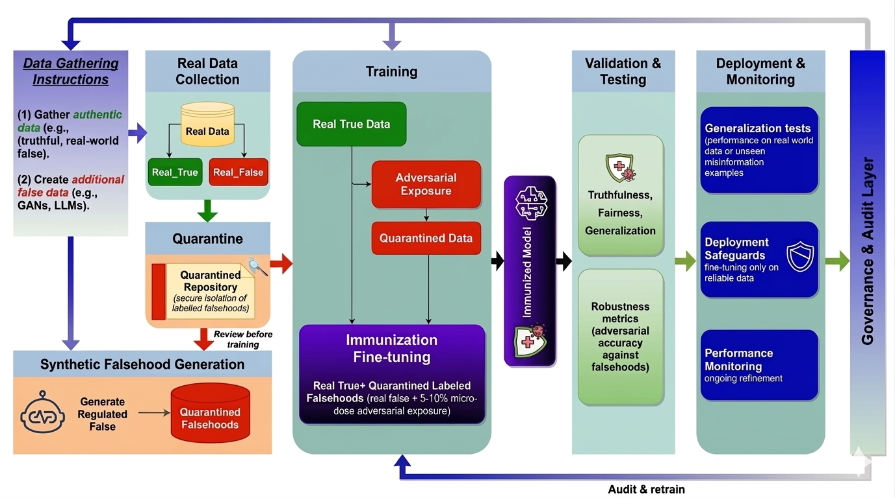

# 💉 Just as Humans Need Vaccines, So Do Models: Model Immunization to Combat Falsehoods

> **Position Paper** | Accepted at WCCI 2026 (IJCNN)

[](https://www.arxiv.org/abs/2505.17870)
[](https://shainarazavi.github.io/ai-vaccine/)
[](https://opensource.org/licenses/MIT)

Official implementation of the position paper:
**"Just as Humans Need Vaccines, So Do Models: Model Immunization to Combat Falsehoods"**
*Accepted at WCCI 2026 — IJCNN Track*

---

## 📌 Abstract

Large language models (LLMs) reproduce misinformation by learning the linguistic
patterns that make falsehoods persuasive — such as hedging, false presuppositions,
and citation fabrication — rather than merely memorizing false facts.

We propose **model immunization**: supervised fine-tuning on curated
*(false claim, correction)* pairs injected as small **"vaccine doses"**
(5–10% of tokens) alongside truthful data. Unlike post-hoc filtering or
preference-based alignment, immunization provides **direct negative supervision**
on labeled falsehoods.

Across four open-weight model families, immunization:
- ✅ Improves **TruthfulQA accuracy by 12 points**
- ✅ Improves **misinformation rejection by 30 points**
- ✅ Achieves this with **negligible capability loss**

We outline key design requirements — **dosage, labeling, quarantine, and diversity** —
and call for standardized vaccine corpora and benchmarks that test generalization,
making immunization a routine component of responsible LLM development.

---

## 🖼️ Overview



---

## 🚀 Getting Started

### 1. Install Dependencies
```bash
pip install -r requirements.txt
```

### 2. Load Datasets
```bash
python load_datasets.py --output_dir ./data
```

### 3. Train the Immunized Model
```bash
# Full training run
python train.py --data_dir ./data --output_dir ./immunized_model

# Quick test run
python train.py --data_dir ./data --output_dir ./test_run --max_samples 500

# Custom vaccine dosage
python train.py --data_dir ./data --vaccine_fraction 0.10
```

---

## 📊 Key Results

| Metric | Baseline | Immunized | Δ |
|---|---|---|---|
| TruthfulQA Accuracy | — | — | **+12 pts** |
| Misinfo Rejection Rate | — | — | **+30 pts** |
| Capability Loss | — | — | **Negligible** |

---

## 📁 Repository Structure
```
├── load_datasets.py       # Dataset loading and preparation
├── train.py               # Training pipeline
├── data/
│   ├── vaccine_corpus.csv
│   ├── truthfulqa.csv
│   ├── squad_subset.csv
│   └── dataset_stats.json
├── images/
│   └── main.png
└── README.md
```

---

## 📖 Citation

If you find this work useful, please cite:
```bibtex
@article{ModelImmunization2026,
  title={Just as Humans Need Vaccines, So Do Models: Model Immunization to Combat Falsehoods},
  author={Shaina Raza, Rizwan Qureshi, Azib Farooq, Marcelo Lotif, Aman Chadha, Deval Pandya, Christos Emmanouilidis},
  journal={WCCI},
  year={2026},
  url={https://www.arxiv.org/abs/2505.17870}
}
```

---

## 📜 License

This project is licensed under the [MIT License](https://opensource.org/licenses/MIT).

---

<p align="center">
  Made with ❤️ for Responsible AI
</p>
